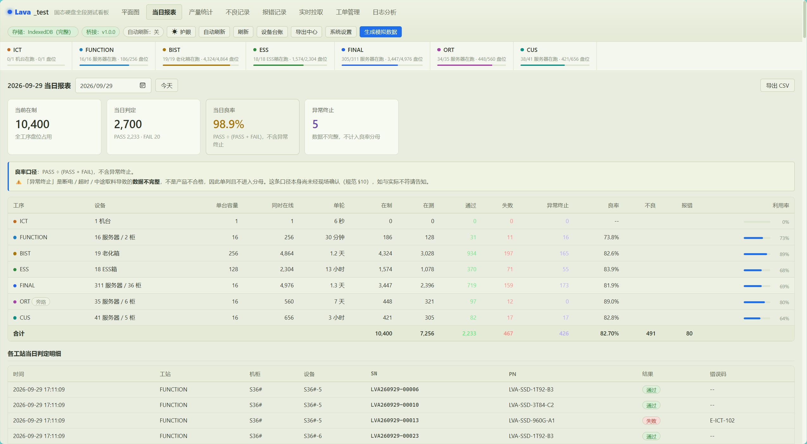
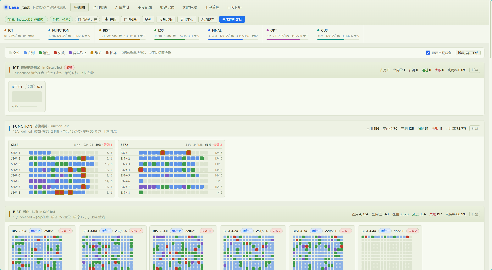
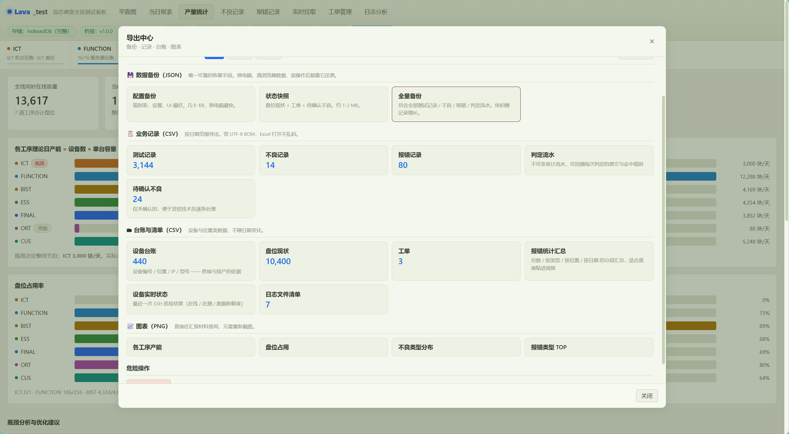

# Lava_test 固态硬盘全段测试看板

Lava_test 是面向 SSD 产线的测试数据看板，将工站、机柜、服务器、盘位与测试日志关联起来，用于查看在制状态、产能瓶颈、不良与报错。

## 作品展示

这是一个面向 SSD 产线的离线优先测试看板作品，重点展示“测试数据接入、产线拓扑可视化、异常定位和数据导出”这一套完整工作流。

| 看板能力 | 展示内容 |
| --- | --- |
| 产线总览 | 按工站、机柜、服务器和盘位查看测试进度与在制状态 |
| 质量分析 | 汇总不良、报错、失败原因和异常趋势，辅助快速定位问题 |
| 数据接入 | 导入 Excel 设备台账，接入 CSV / JSON 日志并自动更新状态 |
| 运维协同 | 管理工单、巡检 SSH / FTP / MES 通道并记录操作日志 |
| 交付方式 | 源码可构建为单文件 HTML，也可运行桌面版并使用 SQLite 保存数据 |

### 展示截图

| 当日报表 | 产线平面图 |
| --- | --- |
|  |  |

| 导出中心 |
| --- |
|  |

### 体验路径

1. 打开 `Lava_test看板.html`，点击“生成模拟数据”查看完整看板。
2. 从设备台账导入入口加载 Excel，检查设备、IP 和盘位映射。
3. 在实时拉取页面检测桥接服务，再导入测试日志观察状态和不良记录变化。
4. 使用导出中心生成 CSV / JSON 备份，或启动桌面版体验本地 SQLite 数据存储。

### 测试看板 HTML 界面

直接打开下面的单文件界面即可体验完整测试看板：

**[打开 Lava_test 测试看板](./Lava_test看板.html)**

该页面无需安装依赖，支持离线查看、生成模拟数据、产线平面图、当日报表、产量统计、不良与报错记录、工单管理、日志分析和数据导出。下载项目后，也可以在本地双击 `Lava_test看板.html` 打开。

## 项目亮点

- 覆盖 `ICT → FUNCTION → BIST → ESS → FINAL → CUS` 全流程，ORT 作为旁路抽检
- 支持 13,585 个盘位的拓扑展示、设备台账导入和产能分析
- 提供平面图、当日报表、产量统计、不良记录、报错记录、实时拉取、工单管理和日志分析
- 支持 Excel 设备台账导入、IP 映射校验，以及 CSV / JSON 数据导出
- 通过解析器注册表和幂等入库流水线接入测试日志，自动更新盘位状态和不良记录
- 配套 Python 桥接服务，支持 SSH、FTP、MES 和本地文件通道
- 源码采用模块化结构，构建为可离线打开的单文件 HTML

## 界面预览

### 当日报表


### 产线平面图


### 导出中心


## 技术栈

`JavaScript` `HTML/CSS` `Node.js` `Python` `IndexedDB` `SSH` `FTP` `Data Visualization`

## 快速开始

直接双击 `Lava_test看板.html`，点击“生成模拟数据”即可查看完整界面。

分享给其他人时，只需发送这个 HTML 文件。桥接服务未启动时，界面以离线模式运行：可查看本地数据、导入设备台账、管理工单和导出备份，连接检测在后台进行，不阻塞页面。SSH 巡检、FTP 拉取和由桥接读取的本地/共享目录仍需桥接服务；启动后点击“实时拉取 → 检测连接”即可重新检测。

双击文件与通过 `http://127.0.0.1:8770/` 打开使用不同的浏览器存储。已有数据需先在原页面导出备份，再在另一种打开方式下导入；发送 HTML 文件不会自动携带浏览器中的数据。若浏览器限制本地文件存储，页面会提示使用本地存储或内存，请按提示导出备份。

```bash
node build.js
npm run verify:all
```

需要接入现场数据时，运行 `bridge\启动桥接服务.bat`，再访问 `http://127.0.0.1:8770/`。

桌面版可运行 `启动桌面版.bat`：Python 会自动启动本地服务并将数据保存到 `data\lava_test.sqlite3`，不再依赖浏览器的 IndexedDB 或 localStorage。安装 `requirements-desktop.txt` 中的可选依赖后，可用 `build-desktop.ps1` 打包成 `dist\LavaTest看板.exe`；没有 pywebview 时会自动打开默认浏览器。

## 项目状态

核心看板、设备台账、数据接入和桥接服务已完成，项目同时包含领域测试、冒烟测试、桥接接口测试和端到端演练。
